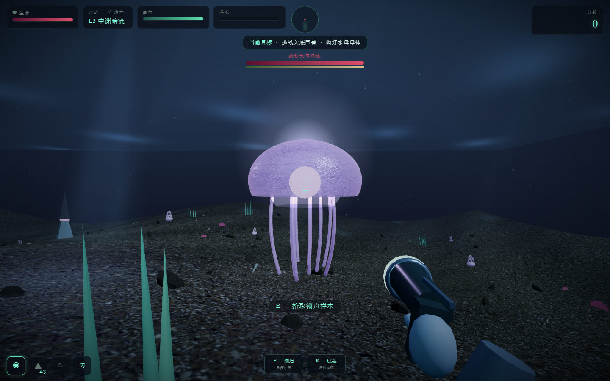
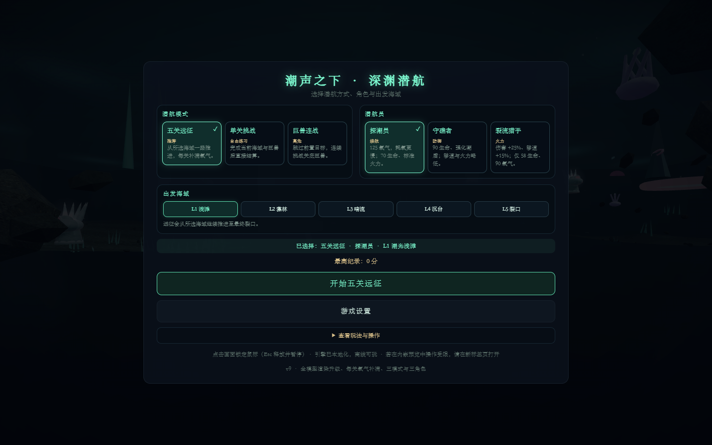

# 潮声之下 · 深渊潜航 3D

第一人称深海探索与战斗小游戏。当前版本为 **v9 全域渲染与多模式版**。

## 运行

下载仓库后，用 Chrome、Edge 等现代浏览器打开 `潮声之下_深渊潜航3D_v9.html` 即可游玩。游戏引擎与美术贴图均保存在仓库内，运行时不依赖网络。

## v9 亮点

- 五关远征、单关挑战、巨兽连战三种真实玩法模式，可自由选择 L1–L5 出发海域
- 探潮员、守礁者、裂流猎手三名潜航员，拥有不同生命、氧气、移动、火力与技能倍率
- 每次进入新关卡自动补满当前角色的生命和氧气，并显示清晰的入场反馈
- 五个关卡、五只特色巨型 Boss；三种武器、闪避、潮盾与过载技能
- 怪物蓄力、突进、远程弹幕、领域技、护阵与协同攻击
- 生物有机细节、轮廓光、透明组织与批量甲片；样本、玩家/敌方子弹均升级为多层晶体与柔光效果
- 本地 PBR 海床/岩石材质、动态焦散、水面波光、体积光、海雪，以及批量渲染的海草、贝壳、骨片、珊瑚与潮晶
- PC 键鼠和移动端触控双端适配
- 自动画质降级、共享 GPU 资源、单批战斗粒子与跨关显存回收

第三方美术资源的来源和许可见 [`assets/THIRD_PARTY_ASSETS.md`](assets/THIRD_PARTY_ASSETS.md)。
