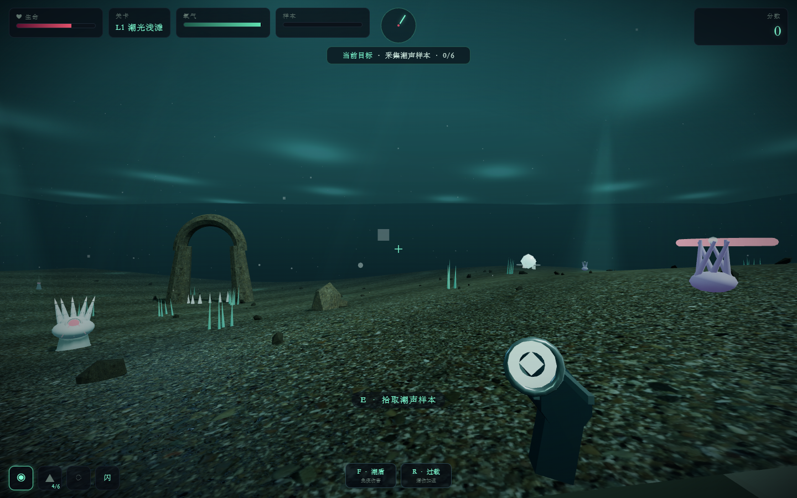

# 潮声之下 · 深渊潜航 3D

第一人称深海探索与战斗小游戏。当前版本为 **v8 深海光影重制版**。

## 运行

下载仓库后，用 Chrome、Edge 等现代浏览器打开 `潮声之下_深渊潜航3D_v8.html` 即可游玩。游戏引擎与美术贴图均保存在仓库内，运行时不依赖网络。

## v8 亮点

- 五个关卡、五只特色巨型 Boss
- 三种武器、闪避、潮盾与过载技能
- 怪物蓄力、突进、远程弹幕、领域技、护阵与协同攻击
- 本地 PBR 海床/岩石材质、动态焦散、水面波光、体积光、海雪与五关专属景观
- PC 键鼠和移动端触控双端适配
- 自动画质降级与跨关显存回收

第三方美术资源的来源和许可见 [`assets/THIRD_PARTY_ASSETS.md`](assets/THIRD_PARTY_ASSETS.md)。
