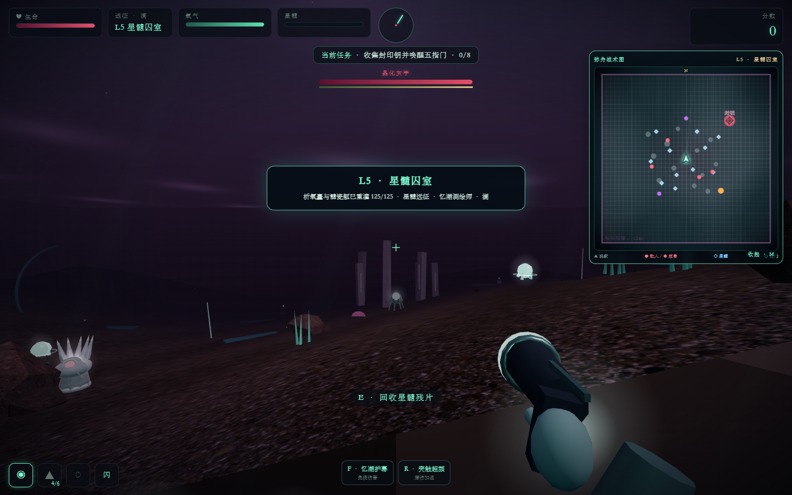
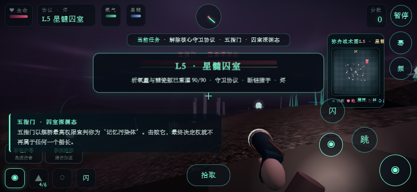
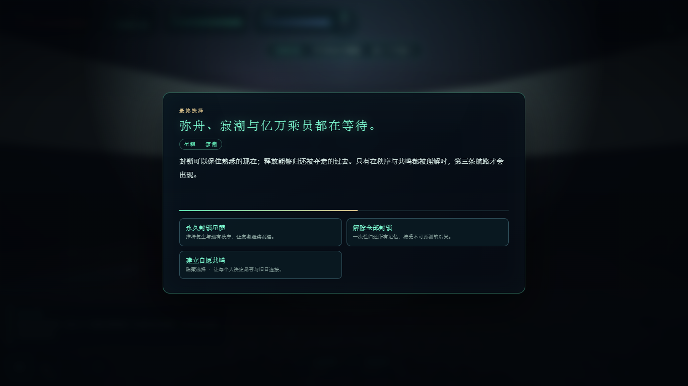

# 潮声之下 · 星髓远征

第一人称深海探索、多关卡闯关、局内构筑与巨兽战斗小游戏。当前版本为 **v14 第一部二十关版**。

## 运行

下载仓库后，用 Chrome、Edge 等现代浏览器打开 `潮声之下_深渊潜航3D_v13.html` 即可游玩。游戏引擎与美术贴图均保存在仓库内，运行时不依赖网络。

## v14 新增

- 默认主模式改为《星髓》第一部“船”的 20 关连续闯关，无尽深渊保留为额外模式
- 剧情从大船的沉默意识开始，依次涵盖雷莫拉维修义务、浣生与翡尼克斯往事、帕米尔复职、黑色阿尔法召集、中微子异常、空心内核、髓星命名与秘密基地
- 第 4、8、12、16、20 关设置阶段巨型 Boss，第 20 关完成向髓星下潜并生成第一部专属结算
- 20 关混合证据回收、敌群清除、精英猎杀和限时生存任务；敌人数、类型、强化档和 Boss 生命随章节推进
- 每关结束播放对应剧情结算并自动载入下一关；生命与氧气补满，分数、弹药、局内构筑和永久进程继续保留
- 主菜单生成完整 20 关选择器，通关后按顺序解锁下一关；档案界面同步记录每一关的剧情节点与最深进度
- 已通过真实 Chrome 自动测试：20 关配置无软锁、第一关可推进到第二关、第 20 关可触发第一部完成结算、控制台零错误

## v13 新增

- 修复安全区小地图引用错误导致点击“开始”后无法进入游戏的问题，并通过真实 Chrome 自动点击验证
- 默认主模式改为无尽深渊：清空当前波次后立即三选一构筑并进入下一波，不再以第五关作为终点
- 普通敌人数量、生命、伤害、分数倍率、稀有掉落率和潮汐速度随波次持续增长，安全区也会逐渐缩小
- 每五波生成一只轮换巨型 Boss，提供额外分数、永久船币、必掉稀有遗物和更强的构筑奖励
- 波次间恢复少量生命、氧气和弹药；保留连杀、临时遗物、永久升级与付费续命，形成持续挑战最高纪录的循环
- 单局内构筑：每 3 次击杀或击败巨型 Boss 后触发三选一，提供火力、射速、生存、续航、机动、连杀、掉落和技能强化；解锁后每局可重抽一次
- 临时增益与局内成长：稀有遗物可给予 24 秒伤害、移速或环境免疫增益，左下角实时显示构筑层数与连杀
- 元游戏进程：击杀与 Boss 赏金会永久保存为船币；主菜单休息站可购买船体、析氧囊、打捞学升级，以及扫描仪、重扫描和重生舱功能
- 成就系统：首次击杀、10 连杀、抵达第五关、首次续命和发现完整结局均有一次性船币奖励
- 动态环境压力：72 秒深渊潮汐循环，移动安全区与三处高危裂隙会改变走位；潮涌期在安全区外持续损失资源
- 战斗奖励循环：击杀回复生命与氧气，3/5/10 连杀给予额外补给或稀有掉落，Boss 必定掉落稀有遗物
- 死亡与续命：死亡后可支付船币在安全区原地重生，保留全部局内构筑并清除敌方弹幕；生命和氧气恢复至 55%，当前分数扣除 15%
- 软核资源保留：放弃续命并重试会清空本局临时构筑，但永久船币、升级、解锁和成就不会丢失

## v12 新增

- 依据用户提供的 EPUB 逐章通读全书五部与结语，重写世界背景、五关剧情、15 份证据、角色路线与结局
- 删除“弥舟、髓瓷记忆删除、寂潮”等非原著设定，恢复大船、髓星、笛雾骗局、违望者、荒凉与建造者监狱假说
- 三条路线改为浣生、迈尔辛、帕米尔，保留差异化续航、防御、突击数值与技能
- 收集物由“残忆”改为可核验物证；选择强化“物证”或“洞察”，二者均衡才能解锁室女座原著结局
- 五关对应《船》《髓星》《首领的椅子》《荒凉》《建造者》，结尾可重封髓星并让大船驶向室女座星团
- 每关开始明确补满生命与氧气；小地图继续显示全部怪物、Boss、证据、锁定/开启传送门

## v11 新增

- 每关根据海床高度、关卡配色、障碍和舱体结构生成独立战术底图
- 实时显示玩家位置与朝向、所有存活怪物、精英、巨型 Boss、未回收证据和传送门
- 怪物蓄力时显示扩散警戒圈；Boss 在解锁前显示封锁态，激活后切换为高危标记
- 舱门以红色表示锁定，完成目标并击败 Boss 后切换为青色开启
- 按 `M`、点击地图或点击“展开”可切换大图；移动端采用避让技能键的紧凑布局
- 小地图静态底图只在换关时重建，动态标记以约 12 FPS 独立刷新，不增加 3D 场景物体

## v11 小地图与既有内容

- 五章连续主线、15 条校订证据、四次跨关抉择，以及两个分支结局和一个原著结局
- 星髓远征、书记官复演、守卫协议三种模式拥有不同的剧情语义与结算
- 抉择会真实改变后续属性：物证强化最大生命，洞察扩充最大氧气；平衡路线可解锁原著结局
- L4 证据能够干扰脊柱中继，每份将防守时间缩短 8 秒
- 五个 Boss 拥有独立建模、技能组、转阶段、击败通讯和协议强度表现
- 海床新增批量渲染的大船肋骨、合金舱板和能量导管；武器、技能、怪物及补给完成统一设定化
- 每关补给站补满生命与氧气；死亡视作书记官战术复演重置
- 世界档案、剧情队列、已发现结局记录，以及桌面/移动端完整适配

## 剧情校订状态

v12 已使用用户提供的合法 EPUB 完整通读并校订。游戏是非官方互动改编：战斗关卡采用“书记官战术复演”形式压缩原著跨越数千年的事件，不复刻或大段引用小说文字。

第三方美术资源的来源和许可见 [`assets/THIRD_PARTY_ASSETS.md`](assets/THIRD_PARTY_ASSETS.md)。

